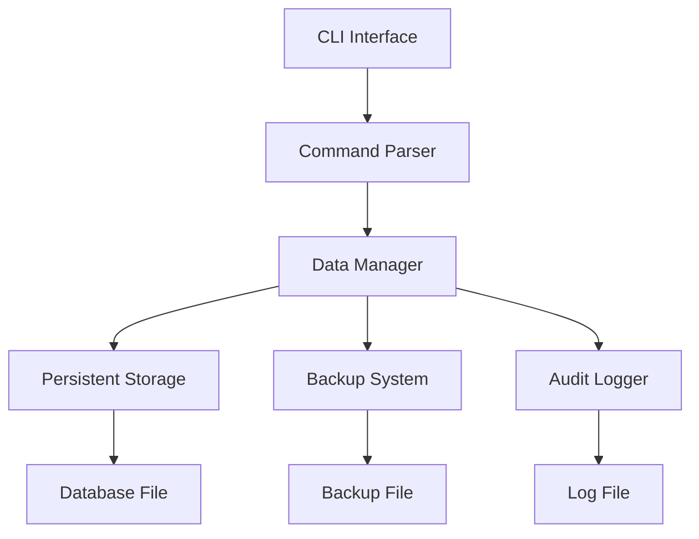

# 🏢 Enterprise Data Server


A **high-performance, enterprise-grade** data management server built in C++ with persistent storage, advanced user management, and professional-grade features.

---

##  Quick Start

###  Installation & Compilation

```bash
# Clone the repository
git clone https://github.com/AzerUI1/enterprise-data-server.git
cd enterprise-data-server

# Compile the server
g++ main.cpp -o enterprise_server -std=c++11 -O2

# Run the server
./enterprise_server
```


---

## 🎯 Features Overview

### 📊 Core Capabilities
| Feature | Icon | Description |
|---------|------|-------------|
| **User Management** | 👥 | Complete CRUD operations for user profiles |
| **Persistent Storage** | 💾 | Automatic data saving and loading |
| **Advanced Search** | 🔍 | Search across all user fields |
| **Backup System** | 🛡️ | Automatic and manual backup creation |
| **Audit Logging** | 📝 | Comprehensive activity tracking |
| **Professional UI** | 🎨 | Formatted tables and clean interface |

### 🏗️ Architecture


---

##  Command Reference

###  **Basic Operations**

| Command | Syntax | Example | Description |
|---------|--------|---------|-------------|
| **ADD** | `ADD` | `ADD` | Add new user interactively |
| **GET** | `GET <name>` | `GET John` | Retrieve user details |
| **LIST** | `LIST` | `LIST` | Display all users in table format |
| **DELETE** | `DELETE <name>` | `DELETE John` | Remove user from database |

###  **Advanced Operations**

| Command | Syntax | Example | Description |
|---------|--------|---------|-------------|
| **UPDATE** | `UPDATE <name>` | `UPDATE John` | Modify user information |
| **SEARCH** | `SEARCH <term>` | `SEARCH company` | Search across all fields |
| **STATS** | `STATS` | `STATS` | Show server statistics |
| **BACKUP** | `BACKUP` | `BACKUP` | Create manual backup |

### ⚡ **System Operations**

| Command | Syntax | Example | Description |
|---------|--------|---------|-------------|
| **GENERATE** | `GENERATE` | `GENERATE` | Create test data |
| **CLEAR** | `CLEAR` | `CLEAR` | Wipe database (requires confirmation) |
| **HELP** | `HELP` | `HELP` | Show command reference |
| **EXIT** | `EXIT` | `EXIT` | Graceful shutdown |

---

## 📖 Usage Examples

### 🎪 **Interactive Demo**

```bash
# Start the server
$ ./enterprise_server

🚀 Initializing Enterprise Data Server... ONLINE

╔══════════════════════════════════════════════════╗
║           ENTERPRISE DATA SERVER v2.1            ║
║             Production Environment               ║
╚══════════════════════════════════════════════════╝

System Status:
  ✓ Database: 0 records loaded
  ✓ Backup System: Active
  ✓ Audit Logging: Enabled
  ✓ Ready for operations

cmd> ADD
Enter user details:
  Name: Alice
  Age: 28
  Email: alice@company.com
  Phone: 5550123456
✅ User 'Alice' registered successfully

cmd> LIST
Registered Users (1 records):
┌──────────────┬─────┬────────────────────────────┬──────────────┐
│ Name         │ Age │ Email                      │ Phone        │
├──────────────┼─────┼────────────────────────────┼──────────────┤
│ Alice        │ 28  │ alice@company.com          │ +1-555-012-3 │
└──────────────┴─────┴────────────────────────────┴──────────────┘
```

### 🎨 **Visual Workflow**


---


### 📊 **File Configuration**
The server automatically manages these files:
- **Data File**: `enterprise_database.dat`
- **Backup File**: `enterprise_backup.dat` 
- **Log File**: `system_log.txt`

---

## 🚀 Performance Features

| Aspect | Performance | Benefit |
|--------|-------------|---------|
| **Data Access** | O(log n) | Fast user lookups |
| **Memory Usage** | Optimal | Efficient STL container usage |
| **Persistence** | Instant | Real-time auto-save |
| **Search** | Multi-field | Comprehensive search capabilities |

---

## 🛡️ Security & Reliability

### ✅ **Safety Features**
- **Input Validation** - All user inputs are validated
- **Error Handling** - Graceful error recovery
- **Data Integrity** - Automatic backup system
- **Audit Trail** - Complete operation logging

### 📝 **Logging Example**
```
[2024-01-15 14:30:25] SYSTEM: Enterprise Server initialized
[2024-01-15 14:31:10] CREATE: User 'Alice' added to database
[2024-01-15 14:32:45] RETRIEVE: User 'Alice' data accessed
```

---

## 🤝 Contributing

We welcome contributions! Please see our [Contributing Guidelines](CONTRIBUTING.md) for details.

### 🐛 Reporting Issues
Found a bug? [Open an issue](https://github.com/yourusername/enterprise-data-server/issues) with:
- Detailed description
- Steps to reproduce
- Expected vs actual behavior

### 💡 Feature Requests
Have an idea? [Submit a feature request](https://github.com/yourusername/enterprise-data-server/issues)!

---

## 📜 License

This project is licensed under the MIT License - see the [LICENSE](LICENSE) file for details.

---

## 🏆 Acknowledgments

- Built with **C++ Standard Template Library**
- Professional-grade **error handling** and **data persistence**
- Inspired by enterprise **data management systems**

---

<div align="center">

### ⭐ **Star this repo if you find it useful!**

**Made with ❤️ for the C++ community**


</div>

---

